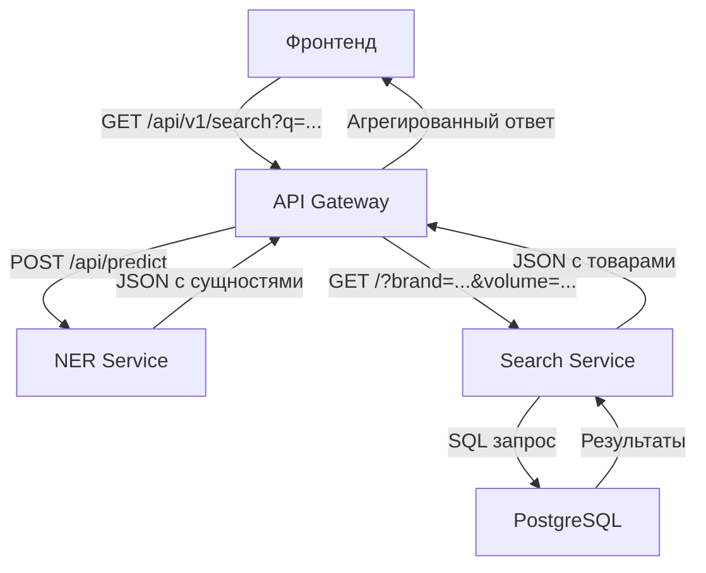

# Архитектура системы поиска товаров

## Обзор

Система представляет собой микросервисную архитектуру для интеллектуального поиска товаров с использованием машинного обучения для извлечения сущностей из текстовых запросов.

## Компоненты системы

### 1. API Gateway (порт 8000)
- **Назначение**: Единая точка входа для фронтенда
- **Технологии**: FastAPI, httpx
- **Функции**:
  - Прием запросов от фронтенда
  - Координация между сервисами
  - Агрегация результатов
  - Форматирование ответа

### 2. NER Service (порт 8001)
- **Назначение**: Извлечение сущностей из текста
- **Технологии**: FastAPI, spaCy, PyTorch
- **Функции**:
  - Анализ текстовых запросов
  - Извлечение сущностей (бренд, тип, объем, процент)
  - Возврат структурированных данных

### 3. Search Service (порт 8002)
- **Назначение**: Поиск товаров в базе данных
- **Технологии**: FastAPI, SQLModel, PostgreSQL, Alembic
- **Функции**:
  - Фильтрация товаров по параметрам
  - Пагинация результатов
  - Управление базой данных

### 4. PostgreSQL (порт 5433)
- **Назначение**: Хранение данных о товарах
- **Структура**: Таблица `product` с полями для фильтрации

## Поток данных

```
Фронтенд → API Gateway → NER Service → API Gateway → Search Service → API Gateway → Фронтенд
```

## Схема взаимодействия



## Форматы данных

### Входной запрос
```json
GET /api/v1/search?q=coca-cola 1.5л&page=1&size=10
```

### Промежуточные данные
- **NER Service**: `[{"start_index": 0, "end_index": 9, "entity": "B-BRAND"}, ...]`
- **Search Service**: `{"items": [...], "total": 2, "page": 1, "size": 10, "pages": 1}`

### Выходной ответ
```json
{
  "entities": [
    {"entity": "BRAND", "value": "coca-cola"},
    {"entity": "VOLUME", "value": "1.5л"}
  ],
  "products": {
    "items": [...],
    "total": 1,
    "page": 1,
    "size": 10,
    "pages": 1
  }
}
```

## Конфигурация

### Переменные окружения
- `NER_SERVICE_URL`: URL NER сервиса
- `SEARCH_SERVICE_URL`: URL Search сервиса
- `DATABASE_URL`: Строка подключения к PostgreSQL

### Docker Compose
- **docker-compose.dev.yml**: Полная система с БД для разработки
- **docker-compose.hackathon.yml**: Только NER сервис для хакатона
- Все сервисы запускаются в отдельных контейнерах
- Автоматическое переподключение при сбоях
- Hot-reload для разработки

## Режимы работы

### Режим разработки (docker-compose.dev.yml)
- Полная система с PostgreSQL
- API Gateway + Search Service + NER Service
- Порт 8000: API Gateway
- Порт 8001: NER Service  
- Порт 8002: Search Service
- Порт 5433: PostgreSQL

### Режим хакатона (docker-compose.hackathon.yml)
- Только NER Service
- Порт 8000: NER Service напрямую
- Минимальная конфигурация для демонстрации ML
