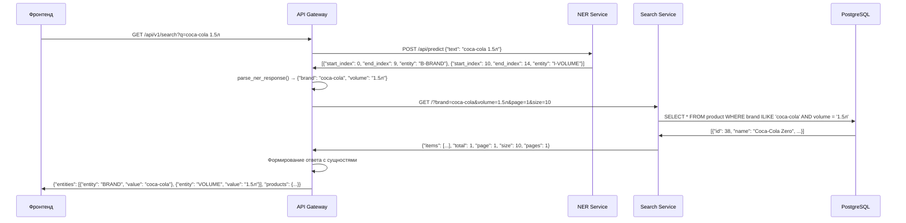

# Поток данных - Документация

## Обзор

Документация описывает полный поток данных от входящего запроса до финального ответа, включая все преобразования и взаимодействия между сервисами.

## Схема потока данных



## Детальный разбор этапов

### 1. Входящий запрос

**Фронтенд → API Gateway**

```http
GET /api/v1/search?q=coca-cola%201.5%D0%BB&page=1&size=10 HTTP/1.1
Host: localhost:8000
Accept: application/json
```

**Параметры:**
- `q`: "coca-cola 1.5л" (URL-encoded)
- `page`: 1
- `size`: 10

### 2. Извлечение сущностей

**API Gateway → NER Service**

```http
POST /api/predict HTTP/1.1
Host: localhost:8001
Content-Type: application/json

{
  "text": "coca-cola 1.5л"
}
```

**Ответ NER Service:**

```json
[
  {
    "start_index": 0,
    "end_index": 9,
    "entity": "B-BRAND"
  },
  {
    "start_index": 10,
    "end_index": 14,
    "entity": "I-VOLUME"
  }
]
```

### 3. Парсинг BIO-разметки

**Внутри API Gateway**

```python
def parse_ner_response(ner_data, text):
    # Входные данные:
    # ner_data = [{"start_index": 0, "end_index": 9, "entity": "B-BRAND"}, ...]
    # text = "coca-cola 1.5л"
    
    entities = {}
    current_entity_type = None
    current_entity_value = ""
    
    for item in ner_data:
        entity_type = item['entity'].split('-')[-1]  # "BRAND", "VOLUME"
        value = text[item['start_index']:item['end_index']]  # "coca-cola", "1.5л"
        
        if item['entity'].startswith('B-'):
            # Сохраняем предыдущую сущность
            if current_entity_type:
                entities[current_entity_type.lower()] = current_entity_value.strip()
            # Начинаем новую сущность
            current_entity_type = entity_type
            current_entity_value = value
        elif item['entity'].startswith('I-'):
            # Продолжение сущности
            if current_entity_type == entity_type:
                current_entity_value += " " + value
            else:
                # Новая сущность
                if current_entity_type:
                    entities[current_entity_type.lower()] = current_entity_value.strip()
                current_entity_type = entity_type
                current_entity_value = value
    
    # Сохраняем последнюю сущность
    if current_entity_type:
        entities[current_entity_type.lower()] = current_entity_value.strip()
    
    return entities
```

**Результат:**
```python
{"brand": "coca-cola", "volume": "1.5л"}
```

### 4. Маппинг параметров

**Внутри API Gateway**

```python
search_params = parsed_entities.copy()
# {"brand": "coca-cola", "volume": "1.5л"}

# Маппинг сущностей на параметры поиска
if 'type' in search_params:
    search_params['category'] = search_params.pop('type')

search_params['page'] = page  # 1
search_params['size'] = size  # 10
```

**Результат:**
```python
{"brand": "coca-cola", "volume": "1.5л", "page": 1, "size": 10}
```

### 5. Поиск товаров

**API Gateway → Search Service**

```http
GET /?brand=coca-cola&volume=1.5%D0%BB&page=1&size=10 HTTP/1.1
Host: localhost:8002
Accept: application/json
```

**Search Service → PostgreSQL**

```sql
SELECT product.id, product.name, product.price, product.old_price, 
       product.image_url, product.rating, product.reviews_count, 
       product.category, product.brand, product.volume, 
       product.percentage, product.in_stock 
FROM product 
WHERE product.brand ILIKE 'coca-cola' 
  AND product.volume = '1.5л' 
LIMIT 10 OFFSET 0;
```

**PostgreSQL → Search Service**

```json
[
  {
    "id": 38,
    "name": "Coca-Cola Zero",
    "price": 150.0,
    "old_price": null,
    "image_url": "https://dobryanka-rus.ru/storage/goods/234159_c9h2S.jpg",
    "rating": 4.9,
    "reviews_count": 180,
    "category": "напитки",
    "brand": "Coca-Cola",
    "volume": "1.5л",
    "percentage": null,
    "in_stock": true
  }
]
```

**Search Service → API Gateway**

```json
{
  "items": [
    {
      "id": 38,
      "name": "Coca-Cola Zero",
      "price": 150.0,
      "old_price": null,
      "image_url": "https://dobryanka-rus.ru/storage/goods/234159_c9h2S.jpg",
      "rating": 4.9,
      "reviews_count": 180,
      "category": "напитки",
      "brand": "Coca-Cola",
      "volume": "1.5л",
      "percentage": null,
      "in_stock": true
    }
  ],
  "total": 1,
  "page": 1,
  "size": 10,
  "pages": 1
}
```

### 6. Формирование ответа

**Внутри API Gateway**

```python
# Создаем сущности для ответа фронтенду
frontend_entities = [
    {"entity": key.upper(), "value": value} 
    for key, value in parsed_entities.items()
]

return {
    "entities": frontend_entities,
    "products": products_data
}
```

**API Gateway → Фронтенд**

```json
{
  "entities": [
    {
      "entity": "BRAND",
      "value": "coca-cola"
    },
    {
      "entity": "VOLUME",
      "value": "1.5л"
    }
  ],
  "products": {
    "items": [
      {
        "id": 38,
        "name": "Coca-Cola Zero",
        "price": 150.0,
        "old_price": null,
        "image_url": "https://dobryanka-rus.ru/storage/goods/234159_c9h2S.jpg",
        "rating": 4.9,
        "reviews_count": 180,
        "category": "напитки",
        "brand": "Coca-Cola",
        "volume": "1.5л",
        "percentage": null,
        "in_stock": true
      }
    ],
    "total": 1,
    "page": 1,
    "size": 10,
    "pages": 1
  }
}
```

## Примеры различных запросов

### Пример 1: Только бренд

**Запрос:** `GET /api/v1/search?q=coca-cola`

**NER Response:**
```json
[{"start_index": 0, "end_index": 9, "entity": "B-BRAND"}]
```

**Parsed Entities:**
```python
{"brand": "coca-cola"}
```

**Search Params:**
```python
{"brand": "coca-cola", "page": 1, "size": 10}
```

**SQL Query:**
```sql
SELECT * FROM product WHERE brand ILIKE 'coca-cola' LIMIT 10 OFFSET 0;
```

**Result:** 2 товара (Coca-Cola Classic, Coca-Cola Zero)

### Пример 2: Категория

**Запрос:** `GET /api/v1/search?q=напитки`

**NER Response:**
```json
[{"start_index": 0, "end_index": 7, "entity": "B-TYPE"}]
```

**Parsed Entities:**
```python
{"type": "напитки"}
```

**Search Params:**
```python
{"category": "напитки", "page": 1, "size": 10}
```

**SQL Query:**
```sql
SELECT * FROM product WHERE category ILIKE 'напитки' LIMIT 10 OFFSET 0;
```

**Result:** 4 товара (все напитки)

### Пример 3: Сложный запрос

**Запрос:** `GET /api/v1/search?q=Простоквашино молоко 2.5% 930мл`

**NER Response:**
```json
[
  {"start_index": 0, "end_index": 12, "entity": "B-BRAND"},
  {"start_index": 13, "end_index": 19, "entity": "B-TYPE"},
  {"start_index": 20, "end_index": 24, "entity": "B-PERCENTAGE"},
  {"start_index": 25, "end_index": 30, "entity": "B-VOLUME"}
]
```

**Parsed Entities:**
```python
{"brand": "Простоквашино", "type": "молоко", "percentage": "2.5%", "volume": "930мл"}
```

**Search Params:**
```python
{"brand": "Простоквашино", "category": "молоко", "percentage": "2.5%", "volume": "930мл", "page": 1, "size": 10}
```

**SQL Query:**
```sql
SELECT * FROM product 
WHERE brand ILIKE 'Простоквашино' 
  AND category ILIKE 'молоко' 
  AND percentage = '2.5%' 
  AND volume = '930мл' 
LIMIT 10 OFFSET 0;
```

**Result:** 1 товар (Молоко Простоквашино 2.5%)

## Обработка ошибок

### Ошибки NER Service
```python
except httpx.RequestError as e:
    raise HTTPException(
        status_code=503, 
        detail=f"NER service is unavailable: {e}"
    )
```

### Ошибки Search Service
```python
except httpx.RequestError as e:
    raise HTTPException(
        status_code=503, 
        detail=f"Search service is unavailable: {e}"
    )
```

### Ошибки базы данных
```python
except OperationalError:
    print("Ошибка: Не удалось подключиться к базе данных.")
```

## Производительность

### Время выполнения (примерное)
- **NER Service**: 100-500ms
- **Search Service**: 10-50ms
- **Общее время**: 150-600ms

### Оптимизация
- Асинхронная обработка
- Индексы в базе данных
- Кэширование (не реализовано)
- Пул соединений

## Мониторинг

### Логирование
- Входящие запросы
- Время выполнения каждого этапа
- Ошибки и исключения
- SQL запросы

### Метрики
- Количество запросов
- Время ответа
- Точность NER
- Использование индексов
